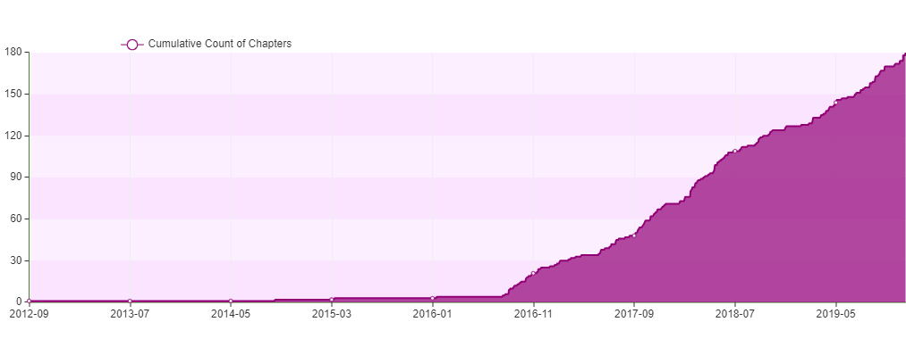
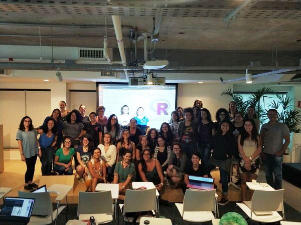
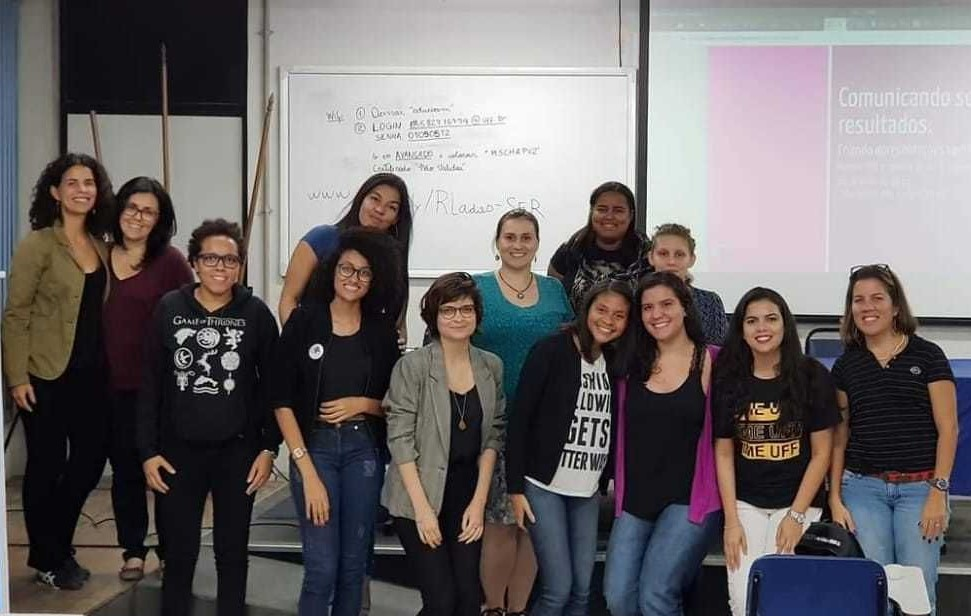
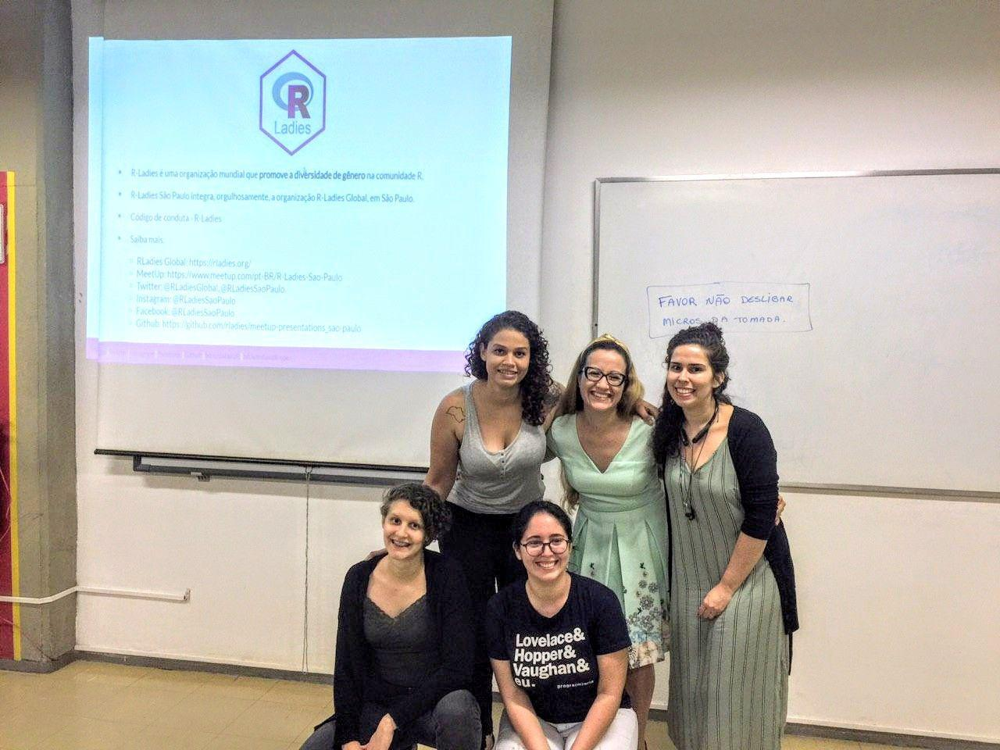
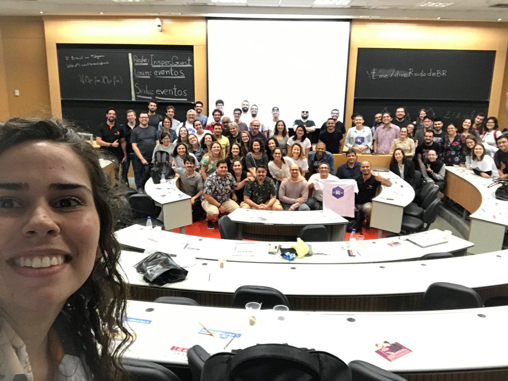
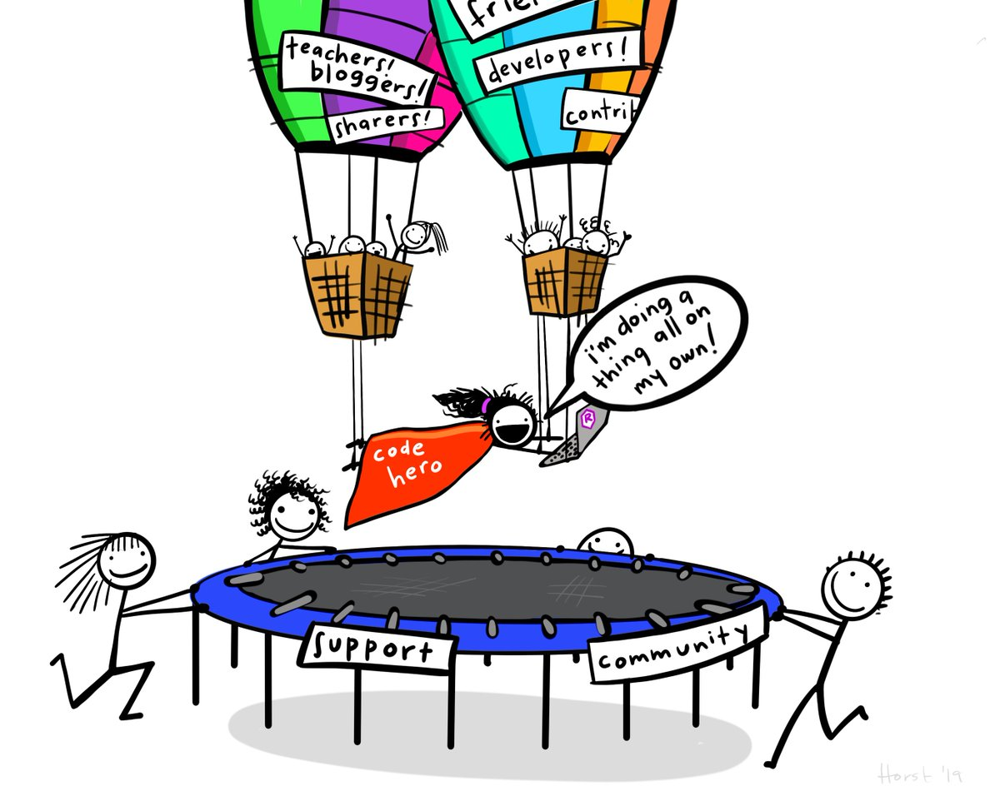

layout: true
  
<div class="my-footer"><span>

Twitter: <a href='https://twitter.com/BeaMilz'>@BeaMilz</a> | <a href='mailto:beatriz.milz@usp.br'>beatriz.milz@usp.br</a> | <a href='https://beatrizmilz.github.io/resume/resume.pdf'> Currículo </a> | Apresentação em: <a href='http://bit.ly/milz2rday'> bit.ly/milz2rday </a>


</span></div> 

```{r setup, include=FALSE}
options(htmltools.dir.version = FALSE)

knitr::opts_chunk$set(echo = FALSE, fig.align = "center", message=FALSE, warning=FALSE)

library(tidyverse)
```

---
class: 

# Beatriz Milz

- Doutoranda no Programa de Pós-Graduação em Ciência Ambiental (PROCAM) - Instituto de Energia e Ambiente - Universidade de São Paulo

  - Bolsita FAPESP - Processo nº 2018/23771-6; Projeto Temático FAPESP Macroamb - Processo nº 2015/03804-9 
  
```{r echo=FALSE, out.width="50%", fig.align='center'}
knitr::include_graphics("img/logos_bia.png")
```

- Equipe da Secretaria Executiva  Editorial - [Revista Ambiente & Sociedade](http://scielo.br/asoc)

- Co-organizadora - [R-Ladies São Paulo](https://www.meetup.com/pt-BR/R-Ladies-Sao-Paulo) `r emo::ji("purple_heart")`

- Co-organizadora [satRday SP](https://saopaulo2019.satrdays.org/)

- Instrutora - [The Carpentries](https://carpentries.org/instructors/)

- Anteriormente: Mestre em Ciências - UNIFESP; Bacharel em Gestão Ambiental - EACH/USP

---
class:   

# Comunidades

## Ponto de vista: contexto de São Paulo
<br> 
```{r echo=FALSE, fig.align='default', out.width="33%"}
knitr::include_graphics(c(
  "img/rainbow.png",
  "img/hex-carpentries.svg",
  "img/satrdaysp.png"
    
  #"img/TheCarpentries.svg"
  
))
```


---
class:  

# R-Ladies


```{r out.width="55%"}
knitr::include_graphics("img/rainbow.png")
```


---
class:  

# O que é o R-Ladies?

R-Ladies é uma organização mundial que promove a diversidade de gênero na comunidade da linguagem R.
R-Ladies São Paulo integra, orgulhosamente, a organização R-Ladies Global, em São Paulo.

## Como?

Através de meetups e mentorias em um ambiente seguro e amigável.

Nosso principal objetivo é promover a linguagem computacional estatística R compartilhando conhecimento, assim, quem tiver interesse na linguagem será bem-vinda, independente do nível de conhecimento. 


Fonte: [About us - R-Ladies](https://rladies.org/about-us/), [Meetup R-Ladies São Paulo](https://www.meetup.com/R-Ladies-Sao-Paulo/)

---
class:   
# Para quem?

Nosso principal público-alvo são as pessoas que se identificam com o gênero feminino, portanto, mulheres cis, mulheres trans, bem como pessoas não-binárias e queer.

## Missão

Como uma iniciativa de diversidade, a missão das R-Ladies é alcançar uma representação proporcional de pessoas de gêneros atualmente sub-representados na comunidade R, incentivando, inspirando e caacitando-as.


## Código de conduta

O R-Ladies dedica-se a proporcionar uma experiência livre de assédio para todas as pessoas partcicipantes, desta forma, não é tolerada nenhuma forma de assédio. [Código de conduta - R-Ladies](https://github.com/rladies/starter-kit/wiki/Code-of-Conduct#portuguese)


Fonte: [About us - R-Ladies](https://rladies.org/about-us/), [Meetup R-Ladies São Paulo](https://www.meetup.com/R-Ladies-Sao-Paulo/)

---
class:   
# Como o R-Ladies começou?
```{r echo=FALSE, fig.align='center', out.width="20%"}
knitr::include_graphics("https://raw.githubusercontent.com/beatrizmilz/IV-SER-RLadies/master/docs/img/gabriela.jpeg")
```


**[Gabriela de Queiroz](https://github.com/gdequeiroz)** fundou o R-Ladies no dia **1 de outubro de 2012**. Ela queria retribuir à comunidade depois de ir a vários encontros e aprender muito de graça. O primeiro encontro R-Ladies foi realizado em ** San Francisco, Califórnia (Estados Unidos) **. Nos anos seguintes, mais capítulos do R-Ladies começaram em todo o mundo.

Fonte: [About us - R-Ladies](https://rladies.org/about-us/history/)

---
class:   

# Crescimento da R-Ladies no mundo


<br>
<br>
```{r echo=FALSE, fig.align='center', out.width="100%"}

```

Atualizado em: Dezembro/2019. Fonte: [R Community Explorer](https://benubah.github.io/r-community-explorer/rladies.html) 
---
class:

# R-Ladies - Capítulos no mundo

<br>
<br>
```{r echo=FALSE, out.width="100%"}

```

Atualizado em: Dezembro/2019. Fonte: [R Community Explorer](https://benubah.github.io/r-community-explorer/rladies.html) 


---
class: 

# R-Ladies no Brasil

```{r eval=FALSE, include=FALSE}
url <- "https://benubah.github.io/r-community-explorer/data/rladies.csv"
download.file(url, "data/rladies.csv", method = "curl")
```

```{r}
rladies <- readr::read_csv("data/rladies.csv")
```

Atualizado em: `r  format(Sys.time(), '%B de %Y')`. Fonte: [R Community Explorer](https://benubah.github.io/r-community-explorer/rladies.html) 


```{r}
library(knitr)
library(kableExtra)
```

```{r echo=FALSE}
rladies %>%
  dplyr::arrange(desc(members)) %>%
  dplyr::filter(country == "Brazil") %>%
  dplyr::select(-X1,-city,-region,-fullurl,-country, -created) %>%
  knitr::kable() %>%
  kableExtra::kable_styling(bootstrap_options = c("striped", "hover", "condensed", "responsive"), full_width = TRUE) %>%
  kableExtra::scroll_box(width = "100%", height = "85%")
```
---
class: 

# R-Ladies em São Paulo

```{r out.width="65%"}
knitr::include_graphics("img/1meetupsp.jpeg")
```
- **Primeiro encontro R-Ladies São Paulo ** - Agosto/2018

- **~600 membros** - Dezembro/2019 

---
class: 
# Atividades

- Já realizamos 15 encontros, incluindo:
  - Meetups, 
  - Workshops, 
  - Datathons 
  
**+ encontros planejados mensalmente!**

```{r out.width="55%"}

```


---
class: 

# Atividades
<br>
## Focado em alguns pacotes:
- Conhecendo o `tidyverse` e os pacotes `dplyr`, `ggplot2`, `rmarkdown`
- Trabalhando com strings com `stringr`
- Apresentações com `xaringan`
- Programação funcional com `purrr`
- Usando o GitHub através do RStudio com o pacote `usethis`
- Entre outros :)

```{r out.width="12%", fig.align = "default"}
knitr::include_graphics(c("img/rlogos/hex-tidyverse.jpg","img/rlogos/hex-dplyr.png","img/rlogos/hex-stringr.png", "img/rlogos/hex-ggplot2.png", "img/rlogos/hex-purrr.jpg", "img/rlogos/hex-rmarkdown.png", "img/rlogos/hex-xaringan.png", "img/rlogos/hex-usethis.png"))
```

---
class: 

# Atividades
<br>
## Focada em casos:

- Explorando dados abertos
- Extraindo dados do Google Analytics
- Explorando dados eleitorais
- Visualização de dados econômicos e de transporte


---
class: 
# Atividades com outros capítulos
.pull-left[
- Workshop na R-Ladies Niterói (Maio/2019).

```{r out.width="100%"}

```
]

.pull-right[
- Palestra na R-Ladies Recife (Setembro/2019).

```{r out.width="100%"}

```
]


---
class: 

# Colaborações

- Também colaboramos em outros projetos:
  - Aulas, Workshops...
  - Sempre abertas para a comunidade. 

Ex: [14ª aMostra Estatística 2019 - IME/USP](https://www.ime.usp.br/~amostra/) - 2 Workshops oferecidos pelas R-Ladies

```{r out.width="55%"}

```
---
class: 

# Pontos importantes:
<BR>
- O grupo oferece um ambiente seguro para pessoas interessadas em `R`, e todas as pessoas devem seguir o código de conduta: [https://github.com/rladies/starter-kit/wiki/Code-of-Conduct#portuguese](https://github.com/rladies/starter-kit/wiki/Code-of-Conduct#portuguese)

- As palestras e conteúdos apresentados são disponibilizados gratuitamente no GitHub: 
   - [https://github.com/rladies/meetup-presentations_sao-paulo](https://github.com/rladies/meetup-presentations_sao-paulo)

- **Todas as atividades são gratuitas**


---
class:  

# The Carpentries 

<br><br><br><br>

```{r out.width="100%"}
knitr::include_graphics("img/TheCarpentries.svg")
```

---
class:  

# The Carpentries 

- Comunidade global que desenvolve e realiza workshops sobre habilidades de programação (principalmente ciência de dados).

- Workshops desenvolvidos pela comunidade!

- Workshops realizados por instrutores que recebem um treinamento e são certificados.

- Tem um [Código de conduta](https://docs.carpentries.org/topic_folders/policies/code-of-conduct.html), sempre sendo discutido e aprimorado!

- Patrocinadores: [disponível aqui](https://carpentries.org/supporters/). Ex: RConsortium, RStudio, entre outros.

---
class:  

# The Carpentries

- **Visão**: Nossa visão é ser a **comunidade inclusiva** líder em ensino de dados e habilidades de programação.

- **Missão**: A Carpentries desenvolve capacidade global em dados essenciais e habilidades computacionais para conduzir pesquisas eficientes, abertas e reproduzíveis. Treinamos e promovemos uma **comunidade ativa, inclusiva e diversificada** de alunos e instrutores que promove e modela a importância do software e dos dados na pesquisa. Colaboramos no desenvolvimento de lições abertas e entregamos essas lições usando práticas de ensino baseadas em evidências. Focamos nas pessoas que conduzem e apoiam pesquisas.

Fonte: https://carpentries.org/about/

---
class:  

# The Carpentries e R


.pull-left[
<br>
```{r echo=FALSE, out.width="50%", fig.align='center'}
knitr::include_graphics(c("img/dc.svg", "img/swc.svg", "img/lc.svg"))
```

- Workshops desenvolvidos pela comunidade!
]

.pull-right[


- **Data Carpentry**

- [Data Analysis and Visualization in R for Ecologists](https://datacarpentry.org/R-ecology-lesson/)

- [Introduction to R for Geospatial Data](https://datacarpentry.org/r-intro-geospatial)

- [Introduction to Geospatial Raster and Vector Data with R](https://datacarpentry.org/r-raster-vector-geospatial)

- **Software Carpentry**

- [Programming with R](http://swcarpentry.github.io/r-novice-inflammation)

- [R for Reproducible Scientific Analysis](http://swcarpentry.github.io/r-novice-gapminder)

- **Library Carpentry**

- [Introduction to R](https://librarycarpentry.org/lc-r/)


]

---
class:  

# Instrutores - Mundo

```{r echo=FALSE, out.width="80%", fig.align='center'}

```

Fonte: https://carpentries.org/instructors-map/
---
class:  

# Instrutores - Brasil

```{r echo=FALSE, out.width="80%", fig.align='center'}
knitr::include_graphics("img/instrutores-br.PNG")
```

Fonte: https://carpentries.org/instructors-map/

---
class:  

# Treinamento de instrutores

1. [Preencher o formulário de interesse](https://amy.carpentries.org/forms/request_training/)

2. Receber email com o link para agendar o treinamento.

3. Fazer o treinamento - 2 dias, online, em inglês.

4. Checkout Process: 

  4.1 Contribuir com um workshop, através do GitHub
 
  4.2 Participar de uma discussão online (community discussion)
  
  4.3 Live coding demo de 5 minutos.


- [Mais informações aqui](https://carpentries.github.io/instructor-training/)

- Estou devendo um post sobre isso! Mas posso tirar dúvidas.

---
class: 

# Desafios para a comunidade BR


- Treinamento de instrutores/as é em inglês

- Poucos instrutores/instrutoras certificados

- Material do workshop está em inglês 


```{r echo=FALSE, out.width="40%", fig.align='center'}
knitr::include_graphics("https://media0.giphy.com/media/QxZ0nbcVgMlPlnfZos/giphy-downsized.gif")
```


```{r eval=FALSE, include=FALSE}
+ Instrutores - + Workshops, + Equipe para traduzir, eventualmente equipe de treinamento de instrutores em português
```


---
class: 

# satRday


```{r echo=FALSE, out.width="50%", fig.align='center'}

```
---
class: 

# satRday

.pull-left[


</br>
</img>

]

.pull-right[

+ O satRday é uma conferência focada em R, __a principal linguagem de código aberto__ de Ciência de Dados.

+ satRday é um __evento internacional__ que foi lançado em 2016.

+ O satRday foi patrocinado pela __RConsortium__, um projeto de código aberto da Linux Foundation que dá suporte à comunidade internacional de R.

+ Os eventos são sempre organizados com o envolvimento da comunidade local.
]

---
class:

# Código de conduta

- O satRdays tem como objetivo proporcionar uma experiência de conferência livre de assédio e inclusiva para todos os participantes, independente, mas não limitado a, gênero, orientação sexual, deficiência, aparência física, idade, raça/etnia, posição social, religião ou afiliação política. 

- Não toleramos nenhuma forma de assédio aos participantes (incluindo organizadores e fornecedores). 

- Imagens e insinuações sexuais não são apropriadas em nenhum local da conferência, incluindo apresentações. 


- Qualquer pessoa que viole estas regras pode ser advertida ou expulsa da conferência (sem reembolso), conforme critérios dos organizadores da conferência. 

Saiba mais em: https://saopaulo2019.satrdays.org/codigodeconduta/

---
class: 

# satRday SP 2019   

- Primeira edição: 30 de novembro de 2019
- Ingresso: R$ 20,00 
- **Diversidade**:
  - Parte dos ingressos foram destinados à pessoas de grupos sub-representados na comunidade de R, e também para estudantes.
  - Alguns ingressos foram sorteados gratuitamente para pessoas de grupos sub-representados.


```{r echo=FALSE, out.width="45%", fig.align='center'}

```

---
class: center

# satRday SP 2019  

## Equipe organizadora

```{r echo=FALSE, fig.align='default', out.width="16%"}
knitr::include_graphics(c("img/team/adrianareis.jpg", 
                          "img/team/angelica.jpg",
                          "img/team/beamilz.jpg",
                          "img/team/brunaw.jpg",
                          "img/team/clente.jpg",
                          "img/team/danielfalbel.jpg",
                          "img/team/fernandafortti.jpg", 
                          "img/team/gabrielacaesar.jpg",
                           "img/team/gabrielz.jpg",
                          "img/team/josejesus.jpg",
                          "img/team/juliotrecenti.jpg",
                          "img/team/leticiathomaz.jpg",
                          "img/team/mariguilardi.jpg",
                          "img/team/nathdemetrio.jpg",
                          "img/team/renatahirota.jpg",
                          "img/team/william.jpg"))
```


---
class:

# Planos pós satRday SP 2019  

- Evento em 2020

- Continuar a buscar maior participação de grupos subrepresentados no evento!

- Criação de um grupo novo: em andamento! 
  - Foco na diversidade na comunidade de R
  - 60 pessoas (10/12/2019)

---
class: 
# Conclusão

- The increasing popularity of the R-Ladies São Paulo shows us how important it is to support it, 

- It can be the key to motivate the creation of other chapters in Brazil, 

- It helps to increase the strength of the Brazilian R community and the inclusion of underrepresented groups. 

- Importância do código de conduta!


---
class:   
```{r echo=FALSE, out.width="65%", fig.align='center'}

```

<center><p>Imagem por <a href='https://twitter.com/allison_horst' target=_blank>@allison_horst</a></p></center>
---
class:   

# Como saber mais? 

## R-Ladies
  - Website RLadies Global: [https://rladies.org/](https://rladies.org/)
  - Twitter: [@RLadiesGlobal](https://twitter.com/rladiesglobal), [@RLadiesSaoPaulo](https://twitter.com/RLadiesSaoPaulo)
  - Instagram: [@RLadiesSaoPaulo](http://instagram.com/RLadiesSaoPaulo)
  - Facebook: [@RLadiesSaoPaulo](http://facebook.com/RLadiesSaoPaulo)
  - MeetUp: [https://www.meetup.com/pt-BR/R-Ladies-Sao-Paulo](https://www.meetup.com/pt-BR/R-Ladies-Sao-Paulo)
  - Github: [https://github.com/rladies/meetup-presentations_sao-paulo](https://github.com/rladies/meetup-presentations_sao-paulo)
  - R-Ladies LATAM Blog (Latin America) - Em breve!
  - Não tem capítulo na sua cidade e quer iniciar um?  Saiba como em <a href="https://rladies.org/about-us/help/"> R-Ladies - How do get involved </a> 
---
class:   

# Como saber mais? 


##  The Carpentries 

- [Website](https://carpentries.org/)
- [Twitter](https://twitter.com/thecarpentries)
- [Facebook](https://www.facebook.com/carpentries/)
- [LinkedIn](https://www.linkedin.com/company/the-carpentries/)
- [Slack](https://swc-slack-invite.herokuapp.com/)

##  satRday

- [satRdays Global](https://satrdays.org/)
- [Base de conhecimento](https://knowledgebase.satrdays.org/)
- satRday Sao Paulo 2019 - [Site do evento](https://saopaulo2019.satrdays.org/) e [Apresentações](https://github.com/satRdays/saopaulo2019_slides)
---
class:   

# Agradecimentos

```{r echo=FALSE, fig.align='center', out.width="40%"}
knitr::include_graphics("https://media1.giphy.com/media/3oz8xIsloV7zOmt81G/giphy.gif")
```

- Comissão Organizadora II RDay, Bruna Wundervald, Nathália Demétrio

- **Contato**:

  - Email: <a href="mailto:beatriz.milz@usp.br">beatriz.milz@usp.br</a>
  - Webpage: https://beatrizmilz.com
  - Github: <a href="http://github.com/beatrizmilz">@beatrizmilz</a>
  - Twitter: <a href="http://twitter.com/beatrizmilz">@BeaMilz</a> 
  - Linkedin: <a href="https://www.linkedin.com/in/beatrizmilz">Beatriz Milz</a>


- Apresentação feita com [Xaringan](https://github.com/yihui/xaringan), com o tema `metropolis` modificado.